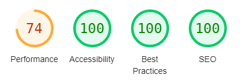

# testIntegrationBlue-e-motion

## Langages, outils et méthodologie utilisés
- html
- scss
- mixin, media, placeholder et variables du scss
- javascript
- photoshop
- méthodologie BEM

## déroulement & temps consacré

J'ai consacré à ce projet 9 jours avec une moyenne de 7h par jour.

- J'ai commencé par le mobile, du lundi au vendredi.
- Ensuite, j'ai travaillé sur le desktop et le responsive, du samedi au lundi.
- Le mardi, j'ai peaufiné quelques détails.
- Le mercredi, j'ai analysé le site avec le devtools lighthouse et pris les mesures nécessaires. Ainsi que ce readme.

La vidéo impacte la performance, mais j'ai préféré ne pas y toucher pour conserver la qualité.

## difficultés rencontrées
- L'ajout de "bloc-sep-1.svg" parmi les images a posé problème. J'avais achevé les versions mobile et desktop, ainsi que l'adaptation au responsive, lorsque j'ai tenté de régler ce problème. J'ai d'abord réussi à contourner le problème avec un transform: rotate() translate(), mais j'ai réalisé que rendre ça responsive nécessiterait une réorganisation complète de la structure. J'ai préféré ne pas perdre de temps là dessus et passer à autre chose.

- J'ai remarqué que le responsive en dehors des dimensions de 393px et 1920px n'est pas parfaitement ajusté. Pour résoudre ce problème, je devrais revoir la structure et le CSS. Bien que je sois tout à fait capable de le faire, cela me prendrait plusieurs jours. Pour éviter de retarder l'envoi du test, j'ai préféré ne pas m'y attarder.

- J'ai rencontré un problème pour afficher la note avec les étoiles 4.6. N'ayant pas trouvé de solution en CSS, j'ai utilisé Photoshop pour superposer une étoile jaune sur une étoile grise et en ai découpé une partie.

- J'ai rencontré des difficultés pour respecter la transition demandée dans la partie D-MAX (présentation des différents modèles d'Isuzu) selon le modèle présenté sur Adobe XD. Bien que j'aurais pu utiliser facilement la bibliothèque Swiper, j'ai préféré rester dans du JavaScript pur pour ce test. J'ai tenté d'utiliser des classes pour gérer les animations d'entrée et de sortie depuis la gauche et la droite, mais je n'ai pas pu les faire apparaître simultanément.

La partie où j'ai le plus eu de difficultés était les transitions avec javascript, notamment le carousel.

## remarques

Dans ce test, tout le HTML est contenu dans index.html. Habituellement, j'aurais divisé le contenu en plusieurs fichiers.
